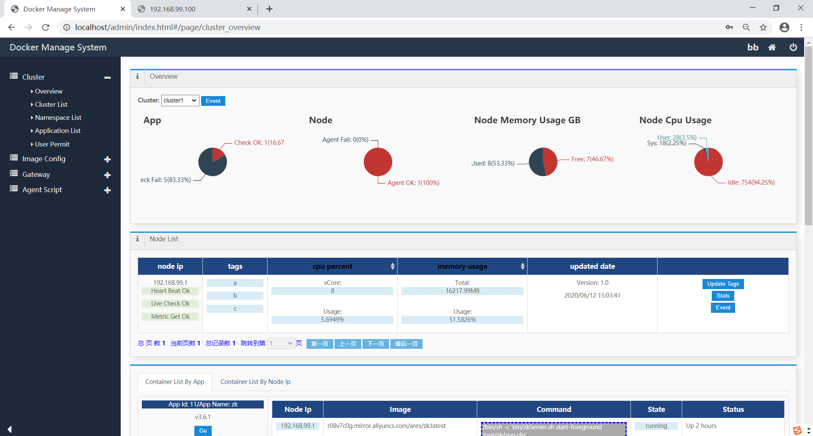
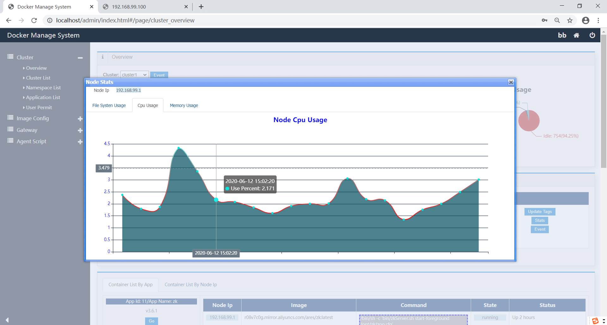
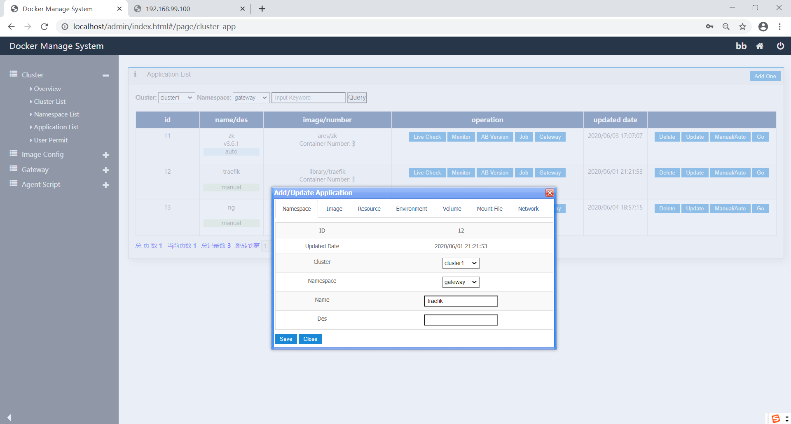
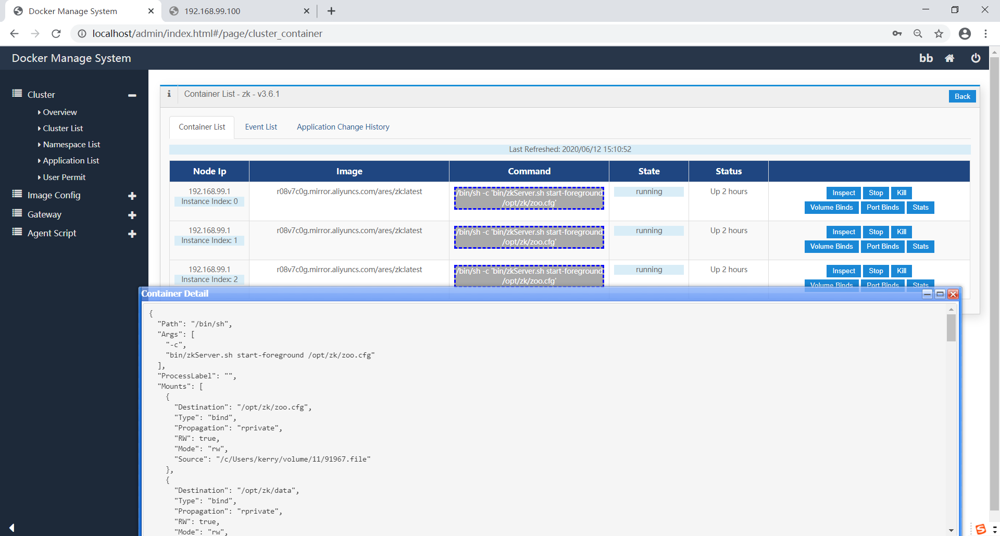
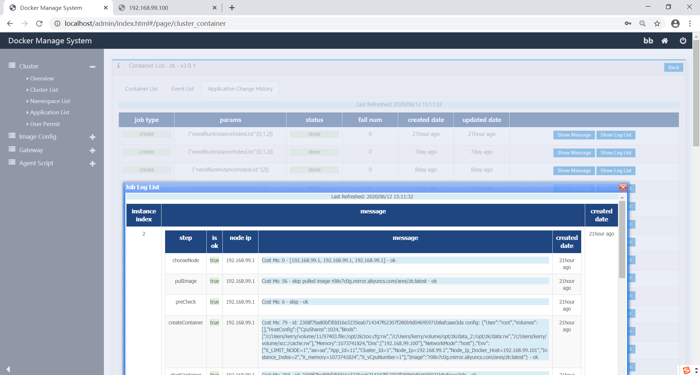

# DMS
Docker Container Runtime Manage System, Like A Mini Kubernetes.

## Start to deploy a master server:


### 1. Build with gradle.

> gradle buildToRun

### 2. Run using groovy command(You need download jdk8+/groovy 2.4.x+ local)

```
cd dms
groovy -cp dist\*:src:resources src/RunServer.groovy
```

TIPS: By default, dms use h2 database and data file is /var/dms/data*, and DMS will create tables when first run. DDL refer init_h2.sql

### 3. View web ui http://127.0.0.1:5000 and login using any username and password.

TIPS: By default, dms do not check password, if you want use your login service, you can change ${projectRoot}/src/conf.properties, dms will post user/password as a form to target url

 ```
login.url=http://server/login
```

You can also create a class implements LoginService in package vendor to use your login service, remember change ${projectRoot}/resources/META-INFO/services/auth.LoginService

TIPS: DMS use SPI to support user define datasource/login service/distributed lock etc.

### 4. Update scripts using by node agent to database table.

after login, then open url: http://127.0.0.1:5000/dms/agent/script/update/batch

### 5. Create first cluster in web ui.

### Others: Change if you need use another database server.

You can use mysql, just change ${projectRoot}/src/conf.properties

```
db.driver=***
db.url=***
db.user=***
db.password=***
db.minPoolSize=5
db.maxPoolSize=10
```

You can also create a class implements DataSourceCreator in package vendor to use your database server.

## Deploy a node agent:

### 6. Install docker/boot2docker, open -H 0.0.0.0:2376

### 7. change ${projectRoot}/src/conf.properties if docker daemon is not localhost.

```
nodeIpDockerHost=127.0.0.1
dockerHostUri=http://127.0.0.1:2376
```

TIPS: If you run node agent in windows using boot2docker like me, need system property set DOCKER_CERT_PATH

### 8. Run using groovy command(You need download jdk8+/groovy 2.4.x+ local)

```
cd dms
groovy -cp dist\*:src:resources src/RunAgent.groovy
```

### Then enjoy

## Some Snapshot Pictures:

cluster overview: 
 

node stats:
 

application create:
 

inspect a container:
 

application job process log: 
 